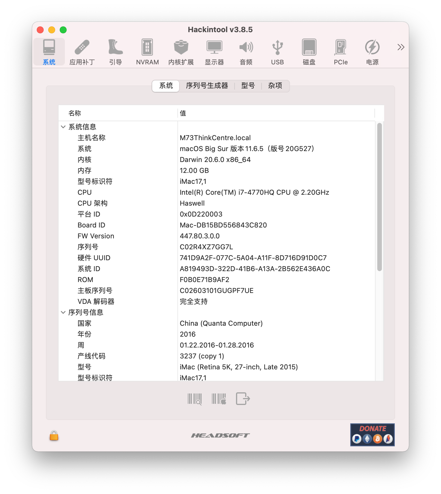
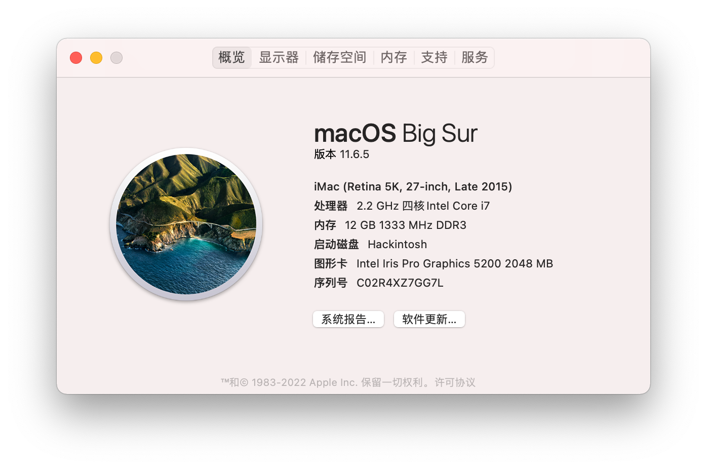
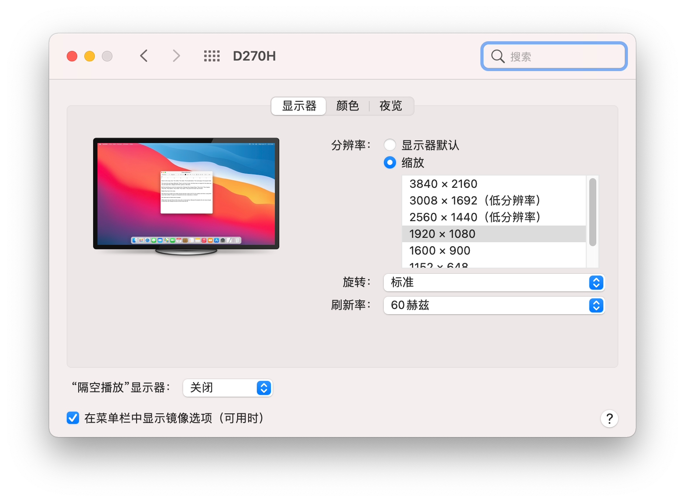

# M73-Hackintosh

### 设备简介

| 型号   | M73 SMBIOS（iMac17,1）            |
| ------ | --------------------------------- |
| CPU    | i7-4770HQ                         |
| 内存   | 三星 8G + 4G DDR3 1333 笔记本内存 |
| 显卡   | iris pro graphics 5200            |
| 显示屏 | 杂牌 4K 显示器 D270H              |
| 网卡   | 8260AC                            |

### 功能

| 睡眠 | 正常 |
| ---- | ---- |
| 蓝牙 | 正常 |
| 唤醒 | 正常 |

### 截图

